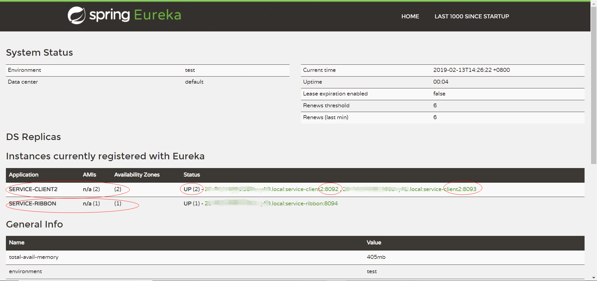

# spring-cloud-examples

> 在 service-ribbon 中实现了调用 eureka-client2 Rest接口的功能。 
>
> 在这里分别启动了两个eureka-client2 实例，端口分别为 8092 和 8093, service-ribbon 在调用接口时实现了轮询式的负载均衡效果。

## 关键点

- pom 文件的引入：spring-cloud-starter-netflix-eureka-client 和 spring-cloud-starter-netflix-ribbon
- 入口类上的注解：@EnableEurekaClient 和 @EnableDiscoveryClient；通过@EnableDiscoveryClient向服务中心注册；
- org.springframework.web.client.RestTemplate 及 @LoadBalanced； 通过@LoadBalanced注解表明这个restRemplate开启负载均衡的功能。
- 配置： eureka.client.serviceUrl.defaultZone=http://localhost:8091/eureka/ 和 spring.application.name=service-ribbon

## 注册中心管理面板

